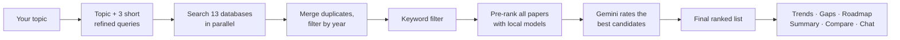

# 🧬 Deep Research Agent

An AI research assistant that finds, ranks and analyzes academic papers for any topic. Built with
**LangGraph**, **Google Gemini 3** (free tier only) and **Streamlit**.

Give it a topic and it searches **13 free academic databases**, ranks the most relevant papers, and turns them
into trends, research gaps, a roadmap and an executive summary. You can compare papers side by side, chat with
them, and export everything as Markdown, BibTeX or CSV.

**Everything is free:** the Gemini API free tier, public paper databases (9 of 13 need no API key at all), and
ranking models that run on your own machine.

---

## Contents

- [Features](#features)
- [Where the papers come from](#where-the-papers-come-from)
- [How it works](#how-it-works)
- [Quick start](#quick-start)
- [Configuration](#configuration)
- [Usage](#usage)
- [Project structure](#project-structure)
- [Tech stack](#tech-stack)
- [Deployment](#deployment)
- [Your data](#your-data)
- [Troubleshooting](#troubleshooting)
- [License](#license)

---

## Features

### Search
- **13 databases searched in parallel**, using your topic plus three short AI-refined queries.
- **Search options**: choose which databases to use and the earliest publication year.
- **Source report**: for every database, see how many papers it returned, how many made your final list, and
  whether it failed or was rate limited.
- **Duplicate merging**: when a paper appears in several databases, the copies are merged (the highest citation
  count, venue, DOI and PDF link are kept) and the card shows where else it was found.

### Ranking
- Every paper gets a **0–5 score** with a visible **score breakdown**:

  | Component | Weight |
  | --- | --- |
  | Cross-encoder relevance (`ms-marco-MiniLM-L-6-v2`, runs locally) | 50% |
  | Gemini relevance rating (0–10) | 20% |
  | Novelty (how different a paper is from the others) | 10% |
  | Venue (top-tier > published > preprint) | 10% |
  | Citations (log-scaled) | 10% |

  Papers whose title contains your exact topic are always ranked first.
- **Sort** by rank, newest or most cited, and **filter** by database.

### Analysis
- **Compare papers**: pick 2–4 papers for a table of problem, method, data, results and limitations, plus
  which one to read first.
- **Trends** across the ranked papers, each citing the papers that support it.
- **Research gaps** in the top 3 papers. Open-access PDFs are downloaded and their final sections (limitations,
  future work) are read; otherwise the abstract is used.
- **Roadmap**: a 4-phase research plan that addresses the gaps.
- **Executive summary** of everything above.
- **Regenerate** any step for a fresh version.

### Chat and export
- **Chat** with the papers and findings. Answers stream word by word, cite papers by number, and know each
  paper's year, authors and citation count. Suggested questions help you get started.
- **Export** a Markdown report, BibTeX references (for LaTeX, Zotero or Mendeley) or a CSV paper list.

### Sessions
- Every research session is saved automatically and can be reopened or deleted from the sidebar.

---

## Where the papers come from

| Database | Covers | API key |
| --- | --- | --- |
| [arXiv](https://arxiv.org) | Preprints in CS, physics, maths, statistics and more | not needed |
| [Crossref](https://www.crossref.org) | DOI records from most journal publishers | not needed |
| [PubMed](https://pubmed.ncbi.nlm.nih.gov) | 36M+ biomedical and life-science citations | optional |
| [Europe PMC](https://europepmc.org) | Life sciences, including bioRxiv and medRxiv preprints | not needed |
| [OpenAIRE](https://explore.openaire.eu) | European open-science graph of repositories and journals | not needed |
| [DOAJ](https://doaj.org) | Peer-reviewed, fully open-access journals | not needed |
| [PLOS](https://plos.org) | Peer-reviewed open-access journals, mainly science and medicine | not needed |
| [HAL](https://hal.science) | Open archive of 4M+ documents, strong in European research | not needed |
| [Zenodo](https://zenodo.org) | CERN's open repository of papers, preprints and reports | not needed |
| [ERIC](https://eric.ed.gov) | Education research from the US Department of Education | not needed |
| [OpenAlex](https://openalex.org) | 250M+ works across every field, with citation counts | optional |
| [Semantic Scholar](https://www.semanticscholar.org) | 200M+ papers, strongest in CS and biomedicine | optional |
| [CORE](https://core.ac.uk) | The largest collection of open-access papers | optional |

All API keys are **free** and **optional**. Without them the app works fully; OpenAlex, Semantic Scholar and
CORE may just be rate limited at busy times (the source report shows when). A PubMed key only raises its
limit from 3 to 10 requests per second.

**Tip:** for biomedical topics, PubMed, Europe PMC and PLOS are the strongest sources; for CS and physics,
arXiv; for education, ERIC.

---

## How it works



1. **Refine**: Gemini writes three short queries (3–6 words each) covering reviews, methods and applications.
   Your original topic is always searched too.
2. **Fetch**: all selected databases are searched in parallel for each query. Duplicates are merged by title.
3. **Filter**: Gemini extracts domain keywords, and papers that mention none of them are dropped (if that would
   remove everything, the filter is skipped).
4. **Rank**: every paper is scored by the local cross-encoder; the best 20–40 candidates get a Gemini relevance
   rating; the final weighted score picks your top papers.
5. **Analyze**: each analysis step runs only when you click its button, so no Gemini requests are wasted.

The whole pipeline is a [LangGraph](https://github.com/langchain-ai/langgraph) state machine with a SQLite
checkpointer, which is what makes sessions resumable.

### Gemini models

The app only uses models available on the **free** Gemini API tier. Free-tier limits apply per model, so the
work is split between two models, and each automatically falls back to the other when rate limited.

| Model | Used for |
| --- | --- |
| `gemini-3.8-flash` | trends, gaps, roadmap, summary, comparison, chat |
| `gemini-3.5-flash-lite` | query refinement, keywords, relevance scoring |

---

## Quick start

Requires **Python 3.12+** (tested on 3.13) and a free
[Google Gemini API key](https://aistudio.google.com/apikey).

```bash
git clone https://github.com/Abhilashaaaaaa13/AI_research_agent.git
cd AI_research_agent

python -m venv .venv
# Windows
.venv\Scripts\activate
# macOS / Linux
source .venv/bin/activate

pip install -r requirements.txt
```

Create a `.env` file in the project root with your Gemini key:

```
GOOGLE_API_KEY=your_gemini_api_key
```

Then run:

```bash
streamlit run app.py
```

The app opens at <http://localhost:8501>. The first run downloads two small ranking models (about 200 MB).

---

## Configuration

All settings go in `.env` (or as environment variables when deployed). Only `GOOGLE_API_KEY` is required.

| Variable | Required | Purpose |
| --- | --- | --- |
| `GOOGLE_API_KEY` | **yes** | Gemini API key from [Google AI Studio](https://aistudio.google.com/apikey) |
| `OPENALEX_API_KEY` | no | Reliable OpenAlex access; sign up at [openalex.org](https://openalex.org) |
| `SEMANTIC_SCHOLAR_API_KEY` | no | Reliable Semantic Scholar access; request at [semanticscholar.org/product/api](https://www.semanticscholar.org/product/api) |
| `CORE_API_KEY` | no | Reliable CORE access; register at [core.ac.uk/services/api](https://core.ac.uk/services/api) |
| `NCBI_API_KEY` | no | Higher PubMed limit; create under *Account settings → API Key Management* at [ncbi.nlm.nih.gov](https://www.ncbi.nlm.nih.gov) |
| `GEMINI_MODEL` | no | Override the analysis model (default `gemini-3.8-flash`) |
| `GEMINI_FAST_MODEL` | no | Override the lightweight model (default `gemini-3.5-flash-lite`) |

Empty values are ignored, so you can leave placeholder lines like `CORE_API_KEY=` in the file.

> **Staying free:** create your Gemini key **without** enabling billing on its Google Cloud project. Requests
> beyond the free limits are then rejected instead of charged. If you override the models, choose ones that
> are on the free tier.

---

## Usage

1. **Start**: enter a topic (or click an example) and choose how many papers you want (3–20). Open
   **Advanced options** to pick databases and a start year (default 2010).
2. **Review papers**: sort, filter by database, open a paper's abstract or score breakdown, and check
   *Where these papers came from*.
3. **Compare**: select 2–4 papers and click **Compare**.
4. **Analyze**: work through **Trends → Gaps → Roadmap → Summary**. Use **Regenerate** for a new version.
5. **Ask**: type a question or click a suggested one in the chat at the bottom.
6. **Export**: use **Export** (top right) for a Markdown report, BibTeX or CSV.

Past sessions appear in the sidebar. Click one to reopen it, or delete the current one from the sidebar.

**Typical timings:** a search takes about 45–60 seconds; each analysis step takes 5–20 seconds.

---

## Project structure

```
├── app.py                  # Streamlit UI: pages, paper cards, analysis, chat, exports
├── agent.py                # LangGraph state machine; one graph action per UI step
├── fetcher.py              # Clients for the 13 databases, per-source stats, duplicate merging
├── ranking_engine.py       # Local embedding models and the scoring formula
├── insight_engine.py       # Gemini clients, prompts, PDF reading and analysis
├── .streamlit/config.toml  # UI theme
├── requirements.txt        # Pinned dependencies
├── Procfile                # Start command for Railway / Heroku
├── runtime.txt             # Python version for deployment
└── .env                    # Your API keys (not committed)
```

---

## Tech stack

| Area | Library |
| --- | --- |
| Agent workflow | LangGraph 1.2 with a SQLite checkpointer |
| LLM | Gemini via `langchain-google-genai` 4.4 |
| UI | Streamlit 1.64 |
| Ranking | `sentence-transformers` 6.1 (bi-encoder + cross-encoder), scikit-learn |
| PDF reading | PyMuPDF |
| Data | pandas 3, NumPy 2 |

---

## Deployment

The `Procfile` runs the app on platforms such as Railway or Heroku:

```
web: streamlit run app.py --server.port=$PORT --server.address=0.0.0.0
```

Set `GOOGLE_API_KEY` (and any optional keys) as environment variables on the platform. `runtime.txt` and
`.python-version` select Python 3.13.

Saved sessions live in a local SQLite file, so on hosts with an ephemeral filesystem they are lost when the
app restarts.

---

## Your data

Everything is stored locally in the project folder, and none of it is committed to git:

| File | Contains |
| --- | --- |
| `checkpoints.sqlite` | Saved sessions: papers, analysis and chat |
| `chat_history.json` | The session list shown in the sidebar |
| `.env` | Your API keys |

Your topic, paper abstracts and chat questions are sent to the Gemini API to generate analysis. Search queries
are sent to the paper databases you select.

---

## Troubleshooting

| Problem | Fix |
| --- | --- |
| "The free-tier rate limit was reached" | Gemini's free tier allows a few requests per minute. The app already switches models and retries; wait a minute and try again. |
| A database shows "rate limited" | Common for OpenAlex, Semantic Scholar and CORE without a key. Add their free key, or rely on the other databases. |
| Few or no papers found | Try a broader topic, select more databases, or choose an earlier start year. |
| Gaps say "Abstract only" | That paper's PDF isn't openly downloadable, so only its abstract was analyzed. |
| "GOOGLE_API_KEY is not set" | Add the key to `.env` and restart the app. |
| First start is slow | The ranking models are downloading (about 200 MB, once). |

---

## License

MIT
